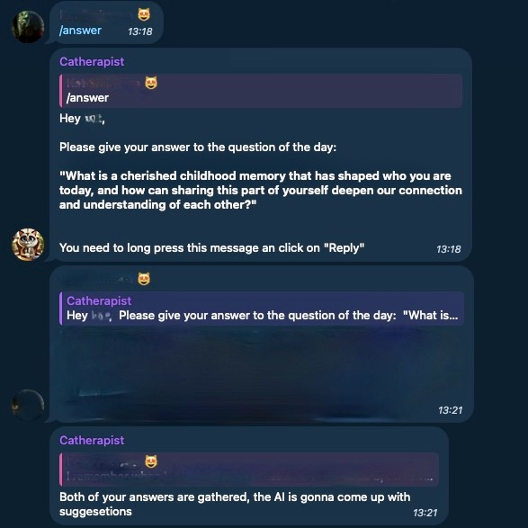

# Telegram Relationship Bot

## Project Overview

The **Telegram Relationship Bot** is designed to help couples, especially those
in long-distance relationships, strengthen their bond and maintain meaningful
communication. It can also be used to know each other better.

This bot provides daily interaction through questions and prompts, encouraging
open and reflective conversations. By facilitating easy engagement, it helps
partners connect emotionally and share their thoughts, regardless of distance.

The bot offers:

- **Daily relationship questions** to inspire meaningful conversations.
- **Personalized feedback and suggestions** based on responses, fostering
growth and intimacy.
- **Reminder functionality** to keep the interaction consistent and prevent
neglect of relationship maintenance.

Whether you’re in a long-distance relationship or just looking for ways to
connect more deeply with your partner, this bot provides a simple yet effective
way to nurture your relationship.
## Demo

### 1. Asking the Daily Question 💬
The bot sends a thought-provoking daily question to both users to spark
meaningful conversations. Each question is designed to help couples reflect on
their relationship and share their feelings.

---

### 2. Lovers Responding 💑
Both users can reply to the bot's question. Their responses remain private
until both have answered, encouraging thoughtful and honest responses.

---

### 3. The Bot Suggesting 🤖
After gathering both responses, the bot analyzes the answers and suggests ways
to deepen the relationship, providing tailored advice based on what was shared.

